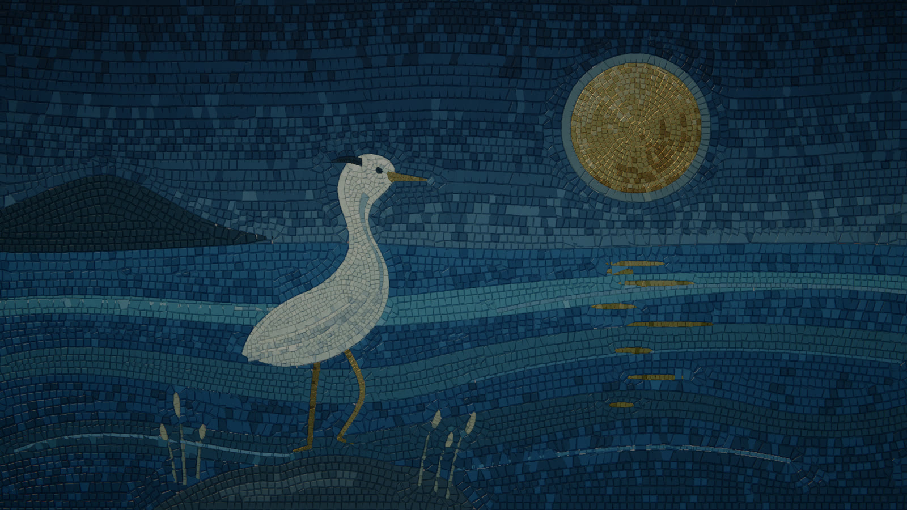

# mosAIc



Make gorgeous physical mosaic art, together with your agent.
Thousands of individually cut stones follow the contours of a picture, catch the light, cast shadows, and move beneath your pointer.
Glass, marble, gold, and mortar share one WebGL2 engine across the browser studio, still images, and animated films.

The project includes an interactive studio and a portable **mosAIc** agent skill.
See them at [mosaic.audiofool.ai](https://mosaic.audiofool.ai).
Start from a deliberately composed key picture or bring an image of your own.

## Try the studio

Use Node.js 20 or newer and a browser with WebGL2 enabled.
From this checkout:

```bash
npm ci
npm run dev
```

Open the local URL printed by the preview command.
The same server shows the project page at its root URL.
Move across the original artwork, change the light, look closer, or choose **Bring an image** to make your own mosaic.
Image analysis and rendering happen in your browser.
Choose glass, stone, or gold, adjust the stone size, and save a PNG.

## Make a piece

The agent and command-line workflows use the same scene files and renderer as the studio.

```bash
node tools/cli.mjs init ./my-mosaic
node tools/cli.mjs inspect ./my-mosaic/project.json
node tools/cli.mjs preview ./my-mosaic/project.json
```

Edit the generated `scene.js` to draw the composition and choose its materials.
Edit `project.json` to set the aspect ratio, timing, and scene transitions.
The included nocturne is a starting point, not a required style or subject.

Capture requires Chromium through Playwright Core:

```bash
npx playwright-core install chromium
node tools/cli.mjs still ./my-mosaic/project.json --time 2 --width 1920 --samples 4 --out ./output/art.png
```

For a silent MP4, install FFmpeg on your system and make it available on `PATH`:

```bash
node tools/cli.mjs render ./my-mosaic/project.json --width 1920 --samples 4 --from 0 --to 120 --out ./output/art.mp4
```

Preview the included two-scene film with `node tools/cli.mjs preview examples/film.json`.
The studio shows playback and scrubbing controls for a project manifest.

The frame range includes `--from` and excludes `--to`.
The project manifest controls frame rate, and output height follows its aspect ratio.
Exports include a receipt describing the source and render settings.
Use `node tools/cli.mjs --help` for the available options.

## Give your agent the skill

Build the portable skill and static website:

```bash
npm run build
```

Copy the complete `dist/mosaic/` directory into your agent's skills directory.
For example, Codex uses `~/.codex/skills/mosaic/` and Claude Code supports `~/.claude/skills/mosaic/`.
Keep the directory intact: it includes the instructions, references, command wrapper, and a self-contained runtime under `assets/runtime/`.
For capture, run `npm ci` and `npx playwright-core install chromium` inside that runtime directory.

Ask your agent to use **mosAIc**, describe the image you want to make, and specify a still, interactive artwork, or film.
The skill guides scene authoring, preview, rendering, and visual inspection without requiring a specific model or paid service.
Its wrapper is `node <skill-directory>/scripts/mosaic.mjs` and supports the same commands as the checkout.

## Put it on a website

The `Pages` workflow tests and builds every push to `main` and publishes `dist/site/` to [mosaic.audiofool.ai](https://mosaic.audiofool.ai) with GitHub Pages.
To host it elsewhere, serve the contents of `dist/site/` from any static HTTP host.
The root is the project page and the studio lives at `site/`.
The build keeps all asset URLs relative, so the site can live under a subdirectory.
For example, after serving the build at `/mosaic/`, embed the complete studio with:

```html
<iframe
  src="/mosaic/site/"
  title="Interactive mosaic studio"
  style="width:100%;height:1000px;border:0"
  loading="lazy">
</iframe>
```

For a custom interface, import `createMosaic` from `engine/runtime.js` and attach it to your own canvas.
The [architecture guide](docs/architecture.md) explains the controller and how to keep the stones, lighting, pointer response, and exports in sync.

## What this alpha does

- Original key pictures with shaped stones, contour-following courses, physical materials, and lighting.
- Image conversion with a bounded palette and controllable stone size and material.
- Pointer-responsive websites, deterministic still capture, and scene-based film rendering.
- A shared portable skill and reproducible distributions with source hashes and license notices.

Continuous video stylization is deferred.
The importer uses image analysis rather than semantic object recognition, so a clear composition and good source image matter.
Movies are silent unless you add sound separately.

The initial GPU visual check uses Chromium on macOS Apple Silicon.
Windows, Linux, Safari, and Firefox have not yet completed visual acceptance.
Software rendering is available through the capture tools but can be slow, and different graphics drivers can produce small pixel differences.
This is an early public-project foundation, not a cross-platform compatibility guarantee.

## Develop

```bash
npm test
npm run check
npm run test:browser
npm run build
```

The project page's pictures and film are rendered from `examples/` by the same engine.
Run `npm run media` after a visual change to render them again; it needs the same Chromium and FFmpeg as capture.

Builds copy the canonical source rather than maintaining a second renderer.
The tests verify mathematical behavior, source-to-bundle equality, and repeatable GPU rendering.
The browser smoke test requires the same Chromium setup as capture.
See [verification](docs/verification.md) for the initial acceptance results and limits, and [architecture](docs/architecture.md) and [source provenance](docs/provenance.md) for implementation details.

Project-authored code is [MIT licensed](LICENSE).
Keep [third-party notices](THIRD_PARTY_NOTICES.md) with distributions, and retain the appropriate rights to any images or sound you import.
